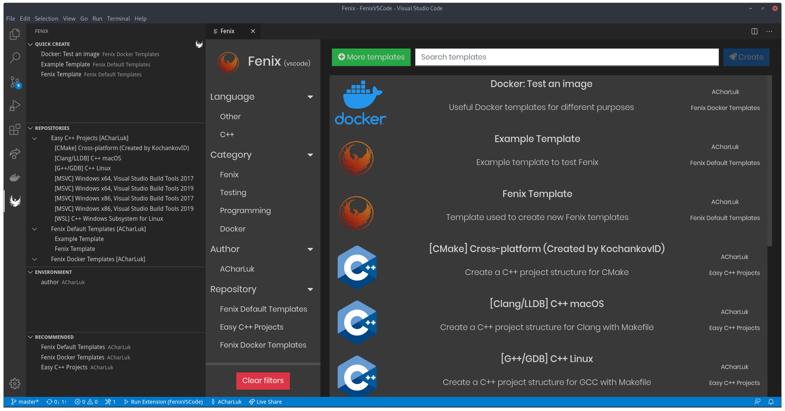

[![Version][version-badge]][marketplace]
[![Installs][installs-badge]][marketplace]

# Important note, please read!
## This extension will be discontinued soon. My new extension  **[Fenix](https://marketplace.visualstudio.com/items?itemName=ACharLuk.fenix)** has been published!

**All Easy C++ Projects templates are available in Fenix** today, please go ahead and try it! You just need to add Easy C++ Projects from the recommended tab in Fenix :)

- Fenix provides the ability to run commands, add your own custom repositories and an overall better UI. Its aim is to extend the functionality Easy C++ Projects has.

- It is also language agnostic, so it is not tied to C++ projects anymore. If you want to create a repository with templates for any other language you can do it!

> I will still push some updates to Easy C++ Projects, but there won't be new features added.

### Finally I want to thank all of you for the support you have given **Easy C++ Projects**. It's been my first ever big project. I did not expect that many people installing it, so thank you from the bottom of my heart for giving it a try and enjoying using it <3

#### I you want to ask my anything or keep up with the development of my projects, I suggest you [follow me on Twitter at @ACharLuk](https://twitter.com/ACharLuk)

---

## Features

### Create C++ projects and classes with just few clicks, for MSVC, GCC and Clang

### It works with MSVC (Windows), GCC (Linux) and Clang (macOS)

### Creating a new project will do the following:
    - Project structure: Common folders like src, include and bin
    - Makefile: A makefile already set up to build and run your project
    - VSCode tasks: Configurations for building and running your project
    - VSCode debug configuration: Debugging already setup for Visual Studio Debugger, GDB and LLDB
    - Add new classes easily with the `Create new class` command

### Creating class will create the appropiate files using one of the templates avaliable [here](https://github.com/acharluk/easy-cpp-projects/tree/master/templates/classes)

---

## Getting started

1. Install the compiler you want to use, look the _Requirements_ section below
2. Open a new folder in VSCode
3. Open the command palette (F1) and search for `easy cpp`, then press the `Create new C++ project` option
4. Enjoy programming! Now you can compile your code using the `Build & Run` button in the status bar at the bottom or F7, you can also set breakpoints and use the debugger!

---

## Requirements

### Windows

- You must have MSVC or GCC installed:
    + MSVC can be installed using Build Tools for Visual Studio 2017 from [here](https://www.visualstudio.com/downloads/)
    + GCC Windows 10: Install GCC and Make on Windows through WSL: [Windows Subsystem for Linux setup](https://github.com/acharluk/UsefulStuff/blob/master/windows/setup_wsl.md)
    + GCC Windows 8.1 or lower: Install GCC and Make using [Cygwin](https://www.cygwin.com/) or [MinGW](http://www.mingw.org/)

### GNU/Linux

- Install GCC, Make and GDB using the package manager of your distribution, these are some of them:
    + Debian/Ubuntu/Mint: `sudo apt install g++ make gdb`
    + Fedora: `sudo dnf install gcc-c++ make gdb`
    + Arch Linux: `sudo pacman -S gcc make gdb`

### MacOS

- GCC: Check out [Brew](https://brew.sh/)
- Clang:
    + Open a Terminal
    + Run the command `xcode-select --install`
    + A dialog will appear telling you that it requires the command line developer tools, and asks if you would like to install them. Click on the "Install" button

## Note:
- You should install C/C++ VSCode extension for the best experience, avaliable [here](https://marketplace.visualstudio.com/items?itemName=ms-vscode.cpptools)
- Alternatively you can run this command from the command palette: `ext install ms-vscode.cpptools`

---

## Release Notes

### 2.0.0

Updated dependencies

Fixed some bugs

Introduced a few more bugs ;)

### 1.7.7

Changed custom templates folder location, now it is safe to save templates and they won't be removed upon extension updates

### 1.7.6

Added support for Visual Studio Build Tools 2019

### 1.7.5

Added "openFiles" property to JSON. It allows the user to set multiple files to open automatically on project creation

### 1.7.4

Fix Easy C++ placeholder not being created when using a custom template

### 1.7.3

New files.json format, now each template can have different directories and blank files created

### 1.7.2

Added "Convert this folder to an Easy C++ Project" command

### 1.7.1

Load extension when the file .vscode/.easycpp is present, avoiding loading it when there is a tasks.json but it is not an Easy C++ project

### 1.7.0

Added support for offline templates if there is no Internet connection avaliable

Added support for custom templates

Added "Open Custom Templates Directory" command

### 1.6.0

Added `Create getter`, `Create setter` and `Create getter and setter` commands. This is in very early stages, so bugs will happen. Please report any bugs to the issues page on GitHub :)

[version-badge]: https://vsmarketplacebadge.apphb.com/version/ACharLuk.easy-cpp-projects.svg
[installs-badge]: https://vsmarketplacebadge.apphb.com/installs/ACharLuk.easy-cpp-projects.svg
[marketplace]: https://marketplace.visualstudio.com/items?itemName=ACharLuk.easy-cpp-projects